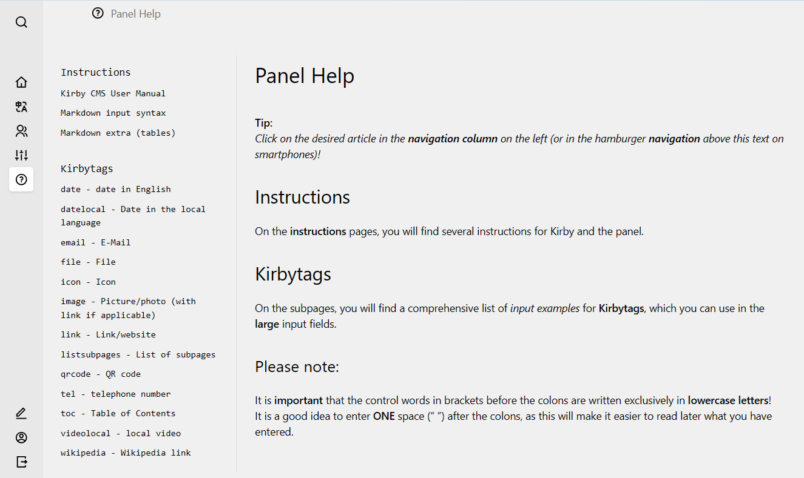

# Helpsection

Adds the Panel view **`Helpsection`** to display help for Panel users.

The Panel view may look like this:

This shows a *possible* content for the help section, which can be customized and translated like normal pages in the Panel.

This plugin "**Helpsection**" allows users to access detailed explanations of Panel input via a special menu item in the main Panel menu.
Users who are logged into the Panel can access the content, which they can call directly in the Panel by clicking on the *question-mark-icon* in the Panel menu on the left, which is highlighted in white in the above visible image.

Due to changes in Kirby version **5.0**, the *previously* created versions of this plugin are no longer usable, which I used on all websites I developed before to provide detailed input help in the Panel.
Therefore, I have created a new plugin version that is compatible with Kirby version 5.x and possibly higher versions.

This plugin displays the contents of the Helpsection on *multilingual websites* in the current **input language** of the Panel user in the panel, if this language is available in the content of the help section. When the input language is changed, the user usually has to refresh the help section.

## Installation

### Download

[Download](https://github.com/heineref/kirby-helpsection/archive/master.zip) the contents of this repository as Zip file.

Rename the **extracted** folder to `heineref_helpsection` and copy it into the `site/plugins/` directory in your Kirby project. If it does not exist, create a new directory `site/plugins/` first.
This file `README.md` therefore receives the path `site/plugins/heineref_helpsection/README.md`.

### Composer

```
composer require heineref/kirby-helpsection
```

### Git submodule

If you have used git in your project before:

```
git submodule add https://github.com/heineref/kirby-helpsection.git site/plugins/heineref_helpsection
```

## Setup

Copy the example structure in [examples/content](examples/) to your content folder.

It looks like:

```filesystem
content
  helpsection
    docindex.txt
    1_overview
      cheatsheet.txt
      1_kirby
        cheatsheet_info.txt
      2_another-info
        cheatsheet_info.txt
    2_details
      cheatsheet.txt
      1_intro
        cheatsheet_item.txt
      2_formats
        cheatsheet_item.txt
        0_bold
          cheatsheet_item.txt
        0_headlines
          cheatsheet_item.txt
        0_link
          cheatsheet_item.txt
```

After the copy you can edit the content of the help pages (add, change, move or delete every help page or change their content or title) while logged in to the Panel with the "**admin**" role (look at "*options: read*" and "*options: update*" of the blueprint file `site/plugins/heineref_helpsection/blueprints/docindex.yml` and the other blueprints of this Plugin). 
If you want/need to change these permissions, copy these blueprints to the path “site/blueprints/pages” and change them there so that they remain unchanged when this plugin is updated. 

Edit the pages in the Panel at "**/helpsection**" (an *unlisted* page).

### Hint

It may be, that you have to make changes in the blueprint file "**`site/blueprints/site.yml`**" to show the **unlisted** page "**/helpsection**" with the blueprint **docindex.yml** at the dashboard (start page) of the Panel, e.g. if you have started with the Kirby-Starterkit (https://github.com/getkirby/starterkit).

## Options

All options require **`HeinerEF.helpsection.`** as prefix.

**`contentfolder`**

- default: `helpsection`
- the content of this folder is loaded into the help view of the Panel

## Requirements

This plugin was built using **Kirby 5.x**. 

It will not work on earlier versions. Therefor look at https://github.com/amteich/kirby-helpsection

## Disclaimer

This plugin is provided "**as is**" with no guarantee. Use it at your own risk and always test it yourself before using it in a production environment.

## License

[MIT](LICENSE.md)

It is not permitted to use this plugin in any project that promotes racism, sexism, homophobia, animal abuse, violence or any form of hate speech.

## Credits

- [Bastian Allgeier](https://github.com/bastianallgeier) for the kirby reference page
- [Christian Zehetner](https://github.com/amteich/kirby-helpsection) for this plugin (for Kirby 3.x)
- [Nico Hoffmann](https://github.com/distantnative) for his help, how to update the k3-plugin to Kirby 5.x
